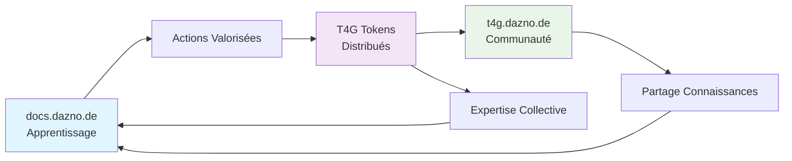

# 🚀 **Stratégie de Synergie Révolutionnaire**
## docs.dazno.de × Token4Good (T4G) | Premier Écosystème Learn-to-Earn Lightning Network

---

## 🎯 **Vision Stratégique : "Lightning Learning DAO"**

Créer le **premier écosystème d'apprentissage décentralisé** au monde spécialisé sur Lightning Network, où l'acquisition de connaissances génère de la valeur tokenisée pour toute la communauté.

### **Positionnement Unique**
> *"La seule plateforme où apprendre Lightning Network vous rémunère ET rémunère la communauté"*

---

## 🔄 **Architecture de l'Écosystème Intégré**

### **Flux de Valeur Bidirectionnel**


---

## 💰 **Modèle Économique Learn-to-Earn**

### **1. Actions Rémunérées en T4G Tokens**

#### **📚 Apprentissage Personnel (Earn by Learning)**
| **Action** | **T4G Rewards** | **Validation** | **Impact Communauté** |
|------------|-----------------|----------------|----------------------|
| **Completion Quiz** | 10 T4G | Auto-validé | Améliore algorithme difficulté |
| **Module Terminé** | 25 T4G | Auto-validé | Données progression collective |
| **Parcours Complet** | 100 T4G | Certification | Nouveau mentor potentiel |
| **Certification Expertise** | 500 T4G | Examen + Peer Review | Leader technique reconnu |

#### **🤝 Contribution Communautaire (Earn by Teaching)**
| **Action** | **T4G Rewards** | **Validation** | **Multiplicateur** |
|------------|-----------------|----------------|-------------------|
| **Question-Réponse Utile** | 15 T4G | Votes communauté | x1.5 si "Best Answer" |
| **Tutoriel Créé** | 200 T4G | Modération + Usage | x2 si >100 vues/semaine |
| **Mentorat Débutant** | 50 T4G/session | Feedback apprenant | x1.2 si NPS >8 |
| **Bug Report/Fix** | 75 T4G | Validation technique | Bonus si critique |
| **Traduction Contenu** | 100 T4G | Review linguistique | x1.5 si langue rare |

#### **⚡ Innovation Lightning (Earn by Building)**
| **Action** | **T4G Rewards** | **Validation** | **Bonus Écosystème** |
|------------|-----------------|----------------|---------------------|
| **Cas d'Usage Partagé** | 150 T4G | Peer Review | +50 T4G si implémenté |
| **Code Open Source** | 300 T4G | Code Review | +100 T4G si adopté |
| **Workshop Animé** | 250 T4G | Participation + Rating | +200 T4G si rediffusé |
| **Research Original** | 500 T4G | Academic Peer Review | +1000 T4G si publié |

### **2. Mécanismes de Valorisation T4G**

#### **🔥 Token Burning & Deflation**
- **5% de tous les T4G gagnés** sont "burned" automatiquement
- **Créer de la rareté** et valoriser les tokens existants
- **Mécanisme déflationniste** récompensant les early adopters

#### **🎁 Staking & Rewards Composés**
```javascript
// Exemple mécanisme staking
const stakingRewards = {
  "30days": { apy: 5%, bonus: "Accès prioritaire nouveaux modules" },
  "90days": { apy: 8%, bonus: "Feedback direct développeurs" },
  "365days": { apy: 15%, bonus: "Co-design roadmap produit" }
};
```

#### **💎 NFT Achievements Uniques**
- **Badges NFT** pour milestones exceptionnels
- **Tradeable** sur marketplace interne
- **Utilité cross-platform** (Discord roles, événements exclusifs)

---

## 🏗 **Intégrations Techniques Révolutionnaires**

### **1. Bridge docs.dazno.de → t4g.dazno.de**

#### **Single Sign-On Lightning**
```javascript
// Authentification unifiée via Lightning
const lightningAuth = {
  wallet: "user_lightning_wallet",
  identity: "did:lightning:user123", 
  reputation: "calculated_from_both_platforms",
  tokens: "synchronized_t4g_balance"
};
```

#### **Real-Time Progress Sync**
```javascript
// Synchronisation instantanée des achievements
const progressSync = {
  docs_completion: "auto_triggers_t4g_rewards",
  t4g_contributions: "unlock_advanced_docs_modules", 
  combined_score: "determines_ecosystem_rank"
};
```

### **2. Gamification Cross-Platform**

#### **🏆 Leaderboards Unifiés**
| **Rang** | **Pseudo** | **T4G Total** | **Specialité** | **Impact Score** |
|----------|------------|---------------|----------------|------------------|
| 🥇 | LightningMaster | 12,450 T4G | Node Operator | 9.8/10 |
| 🥈 | BitcoinEdu | 8,920 T4G | Pédagogie | 9.6/10 |
| 🥉 | DevLN_Pro | 7,335 T4G | Développement | 9.4/10 |

#### **⚡ Challenges Cross-Platform**
```yaml
Monthly_Lightning_Challenge:
  titre: "Optimisez 10 nœuds communautaires"
  rewards: 1000 T4G + NFT exclusif
  participants: docs users + t4g community
  duration: 30 jours
  metrics: ROI improvement + community votes
```

### **3. IA Recommandations Personnalisées**

#### **Smart Learning Path**
```python
def generate_personalized_path(user_profile):
    """
    Analyse combinée docs.dazno.de + t4g.dazno.de
    pour créer parcours optimal
    """
    learning_history = get_docs_progress(user_id)
    community_contributions = get_t4g_activity(user_id)
    peer_similarities = find_similar_users(user_profile)
    
    return {
        "next_modules": ai_recommended_content,
        "earn_opportunities": high_reward_contributions,
        "mentor_matches": suitable_mentors,
        "skill_gaps": areas_needing_focus
    }
```

---

## 🌟 **Fonctionnalités Révolutionnaires**

### **1. "Lightning Proof-of-Learning"**

#### **Concept Unique**
- **Chaque connaissance acquise** génère une "preuve cryptographique"
- **Stockée sur blockchain** (Lightning-native ou sidechain)
- **Vérifiable par employeurs/partenaires** via QR code
- **Expiration temporelle** nécessitant mise à jour continue

#### **Implémentation**
```solidity
contract ProofOfLearning {
    struct Knowledge {
        bytes32 skillHash;      // Hash du skill acquis
        uint256 timestamp;      // Quand acquis
        uint256 difficulty;     // Niveau de difficulté
        address validator;      // Qui a validé
        uint256 t4g_earned;    // Tokens gagnés
    }
    
    mapping(address => Knowledge[]) public userSkills;
}
```

### **2. "Mentorship Mining"**

#### **Principe**
- **Pairer automatiquement** experts et débutants
- **Récompenser les deux parties** en T4G
- **Mesurer impact pédagogique** via metrics
- **Créer lignées d'apprentissage** (qui a formé qui)

#### **Mechanics**
```javascript
const mentorshipMining = {
  matching_algorithm: "AI-based skill/personality matching",
  session_rewards: "50 T4G mentor + 25 T4G mentee", 
  success_bonus: "x2 multiplier if mentee completes path",
  reputation_system: "Mentor rating affects future rewards"
};
```

### **3. "Collective Intelligence Rewards"**

#### **Sagesse de la Foule**
- **Questions posées** sur docs génèrent récompenses T4G
- **Meilleures réponses** de t4g.dazno.de intégrées docs
- **Amélioration continue** du contenu par la communauté
- **Curation décentralisée** des ressources

#### **Exemple Concret**
```
User DocReader pose: "Comment optimiser fees Lightning pour micropaiements?"
→ Question propagée sur t4g.dazno.de
→ 5 réponses de la communauté (50 T4G each)
→ Vote communautaire meilleure réponse (+100 T4G bonus)
→ Réponse intégrée automatiquement dans docs.dazno.de
→ Auteur gagne 25 T4G à chaque consultation future
```

---

## 📱 **Expérience Utilisateur Révolutionnée**

### **1. Dashboard Unifié "Lightning Central"**

#### **Vue d'ensemble**
```
┌─────────────────────────────────────────┐
│  ⚡ Lightning Central - Mon Tableau de Bord │
├─────────────────────────────────────────┤
│ 💰 T4G Balance: 1,247 tokens           │
│ 📈 Rang Communauté: #42/2,847 membres  │
│ 🎯 Progression Actuelle: 73% Module LN │
│ ⭐ Impact Score: 8.4/10                 │
├─────────────────────────────────────────┤
│ 🎯 ACTIONS RECOMMANDÉES:               │
│ • Finir Quiz "Channel Management" (+15 T4G) │
│ • Répondre question @newbie_user (+25 T4G)  │
│ • Participer challenge mensuel (+500 T4G)   │
└─────────────────────────────────────────┘
```

### **2. "T4G Wallet" Intégré**

#### **Portefeuille Lightning Learning**
- **Solde T4G temps réel** visible partout
- **Historique gains** détaillé par activité
- **Staking dashboard** avec projections APY
- **Marketplace** pour échanger T4G contre services

### **3. Mobile App "Lightning Learn"**

#### **Notifications Intelligentes**
```json
{
  "type": "earn_opportunity",
  "title": "🎯 Gagnez 75 T4G maintenant!",
  "message": "Question urgente sur optimisation ROI",
  "action": "Aidez @struggling_node_operator",
  "reward": "75 T4G + possible bonus mentor",
  "expires_in": "2 heures"
}
```

---

## 🚀 **Stratégie de Lancement "Genesis Mining"**

### **Phase 1 : Early Adopters (Mois 1-2)**
- **1000 premiers utilisateurs** reçoivent "Genesis NFT"
- **Rewards x3** pour toutes actions (limited time)
- **Exclusive access** aux développeurs et roadmap
- **Founder status** permanent dans communauté

### **Phase 2 : Community Bootstrap (Mois 3-6)**
- **Système de parrainage** : 100 T4G par nouveau membre actif
- **Content creation bounties** : 1000 T4G pour premiers tutoriels
- **Bug hunting program** : jusqu'à 500 T4G par bug critique
- **Ambassador program** : revenus récurrents T4G

### **Phase 3 : Ecosystem Maturity (Mois 6-12)**
- **DAO governance** avec votes pondérés T4G
- **External partnerships** (universités, entreprises)
- **API publique** pour intégrations tierces
- **T4G marketplace** avec produits/services Lightning

---

## 📊 **Modèle Économique & Business Model**

### **💰 Sources de Revenus Diversifiées**

#### **1. Premium Lightning Pro (€29/mois)**
- **Multiplier T4G x1.5** sur tous gains
- **Accès prioritaire** nouveaux modules
- **Analytics personnels** détaillés
- **Support prioritaire** communauté

#### **2. Corporate Training Licenses**
- **Entreprises** forment employés sur écosystème
- **T4G corporate pools** pour motivation équipes
- **Certifications** reconnues industrie
- **White-label** solutions pour grandes organisations

#### **3. Marketplace Commissions (5%)**
- **Échanges T4G** contre services
- **NFT trading** achievements
- **Consulting** paid in T4G
- **Premium content** created by community

### **🎯 Métriques de Succès**

#### **KPIs Ecosystem (12 mois)**
- **50K utilisateurs actifs** monthly
- **10M T4G tokens** in circulation
- **€1M ARR** from premium subscriptions
- **500 corporate clients** using platform
- **95% retention** rate active learners

#### **KPIs Communauté (12 mois)**
- **100K contributions** quality content
- **10K successful** mentorship sessions
- **5K certified** Lightning experts
- **1K ambassadors** worldwide active

---

## 🔮 **Innovations Futures**

### **1. "Lightning University" Accredited**
- **Partenariats universités** pour crédits ECTS
- **Bachelor/Master** programmes Lightning
- **Research grants** funded by T4G ecosystem
- **Academic papers** incentivized with tokens

### **2. "Metaverse Lightning Campus"**
- **Campus virtuel 3D** pour formations immersives
- **VR workshops** avec équipement réel simulé
- **Avatar economies** powered by T4G
- **Virtual conferences** avec speakers holographiques

### **3. "AI Teaching Assistants"**
- **Personnalités IA** spécialisées par domaine
- **Formation continue** via machine learning communauté
- **Support 24/7** multilingue
- **Adaptive difficulty** basée sur performance collective

---

## 🎯 **Plan d'Implémentation 90 Jours**

### **Semaine 1-2 : Fondations Techniques**
- [ ] **Bridge API** docs ↔ t4g authentication
- [ ] **T4G wallet** integration basics
- [ ] **Quiz système** with token rewards
- [ ] **Leaderboard** prototype

### **Semaine 3-4 : Gamification Core**
- [ ] **Achievement system** NFT badges
- [ ] **Progress tracking** unified
- [ ] **Community features** basic (Q&A)
- [ ] **Mobile responsive** optimization

### **Semaine 5-6 : Advanced Features**
- [ ] **Mentorship matching** algorithm
- [ ] **Staking mechanism** implementation
- [ ] **Marketplace MVP** for services
- [ ] **Analytics dashboard** personal

### **Semaine 7-8 : Community & Content**
- [ ] **Content curation** system
- [ ] **Moderation tools** community-driven  
- [ ] **Ambassador program** structure
- [ ] **Beta testing** with select users

### **Semaine 9-12 : Polish & Launch**
- [ ] **Bug fixes** and optimizations
- [ ] **Mobile app** development
- [ ] **Marketing campaign** preparation
- [ ] **Genesis launch** with early rewards

---

## 💡 **Différenciation Concurrentielle Unique**

### **Avantages Incontournables**

1. **🥇 Premier écosystème Lightning Learn-to-Earn** au monde
2. **⚡ Intégration native** avec vrais systèmes Lightning
3. **🤝 Double valeur** : apprentissage + contribution
4. **🌍 Communauté francophone** expertise Lightning
5. **🔗 Blockchain-verified** skills et achievements

### **Barrières à l'Entrée Créées**

- **Network effects** : plus d'utilisateurs = plus de valeur
- **Content moat** : bibliothèque exclusive créée par communauté  
- **Token economics** : early adopters advantagés long terme
- **Technical complexity** : difficile à répliquer rapidement
- **Brand authority** : première association Lightning + Learn-to-Earn

---

## 🚀 **Conclusion : Révolution de l'Éducation Blockchain**

Cette synergie docs.dazno.de × Token4Good a le potentiel de créer **la première université décentralisée Lightning** au monde, où :

✅ **Apprendre génère de la valeur économique réelle**
✅ **Enseigner devient un métier viable**  
✅ **La communauté s'autofinance et se développe**
✅ **L'expertise collective augmente exponentiellement**
✅ **L'innovation Lightning s'accélère massivement**

**Cette approche révolutionnaire positionnerait Dazno comme le pionnier incontesté de l'éducation Web3**, créant un écosystème auto-entretenu qui croît organiquement et génère de la valeur pour tous les participants.

**L'avenir de l'apprentissage Lightning Network commence maintenant ! ⚡**

---

*Stratégie développée pour l'écosystème Dazno | Août 2024*